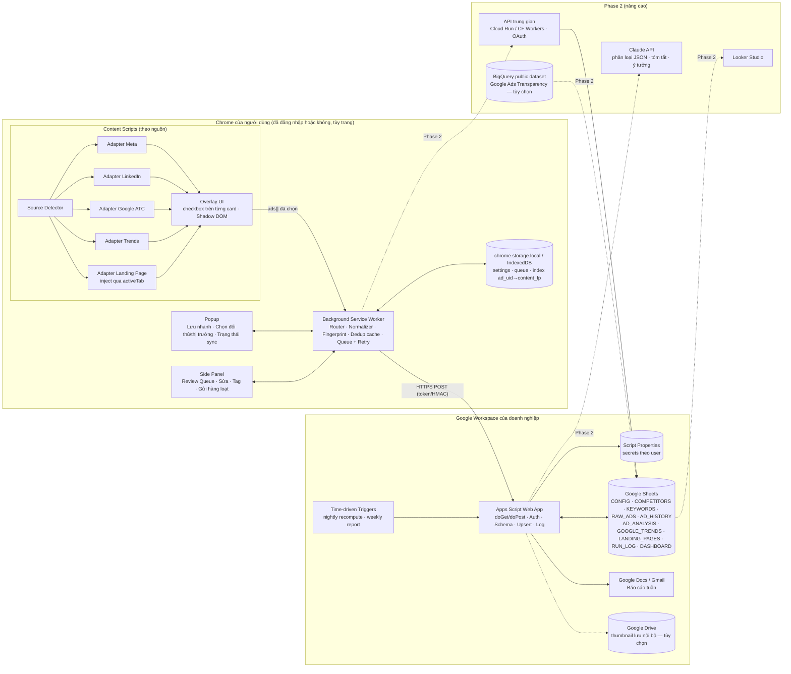
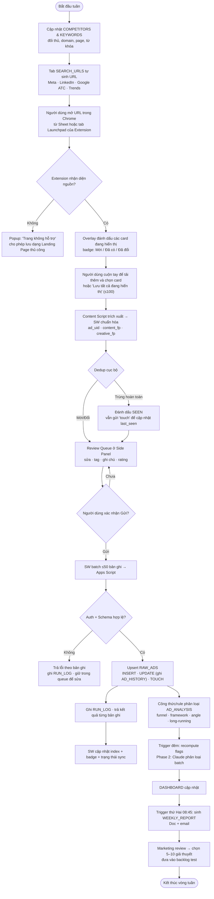

# 01 — Kiến trúc, Flowchart và User Journey

## 1. Sơ đồ kiến trúc tổng thể

### Trách nhiệm từng thành phần

| Thành phần | Trách nhiệm | Không làm |
|---|---|---|
| **Content Script** | Nhận diện nguồn, tìm card quảng cáo trong DOM **đang hiển thị**, trích xuất trường, vẽ overlay checkbox, gửi dữ liệu thô về SW | Không tự cuộn, không click "Xem thêm/See more" hàng loạt, không gọi API ẩn của nền tảng, không đọc cookie/token |
| **Popup** | Nút "Lưu quảng cáo", "Lưu tất cả đang hiển thị", chọn ngữ cảnh (đối thủ/thị trường/sản phẩm/chiến dịch), mở Side Panel, xem trạng thái sync | Không sửa hàng loạt (việc của Side Panel) |
| **Side Panel** | Review Queue dạng bảng: xem trước, sửa trường, tag, ghi chú, đánh giá 1–5, gửi | — |
| **Service Worker** | Chuẩn hóa, tạo `ad_uid`/`content_fp`/`creative_fp`, dedup cục bộ, hàng đợi, retry, gọi Apps Script, đồng bộ index | Không giữ state trong biến toàn cục (MV3 SW có thể bị tắt bất kỳ lúc nào), mọi state nằm trong storage |
| **Apps Script** | Xác thực, validate schema, upsert theo khóa, ghi lịch sử thay đổi, RUN_LOG, trigger định kỳ, sinh báo cáo | Không crawl các nền tảng quảng cáo |
| **Google Sheets** | Lưu trữ, công thức phân loại, dashboard | Không lưu secret dạng plaintext |

---

## 2. Flowchart từ tìm kiếm đến báo cáo

Luồng phụ **Google Trends**: mở URL Explore → Extension đọc biểu đồ "Interest over time", "Related queries" (Top/Rising) đang hiển thị **hoặc** người dùng bấm nút ⬇ Export CSV có sẵn của Trends rồi kéo thả CSV vào Side Panel → ghi vào `GOOGLE_TRENDS`.

Luồng phụ **Landing Page**: từ một bản ghi quảng cáo, bấm "Mở & kiểm tra LP" → người dùng mở trang → bấm "Lưu Landing Page" → inject script qua `activeTab` → trích xuất → so sánh `section_hash` với lần trước → ghi `LANDING_PAGES` (+ `change_summary`).

---

## 3. User journey chi tiết

Persona chính: **Linh — Performance Marketer**, 1–2 giờ/tuần cho competitive research. Persona phụ: **Founder** chỉ đọc báo cáo tuần.

| Bước | Người dùng làm | Hệ thống phản hồi | UI/UX chú ý | Lỗi/ngoại lệ |
|---|---|---|---|---|
| **1. Khai báo** | Mở Sheet → tab `COMPETITORS`: nhập tên, website, domain, Meta Page URL/Page ID, LinkedIn company URL, tên nhà quảng cáo Google (hoặc Advertiser ID `AR…`), sản phẩm, thị trường. Tab `KEYWORDS`: nhập từ khóa, nhóm, ngôn ngữ | Data validation: domain đúng định dạng, trạng thái chọn từ dropdown. `competitor_id` tự sinh (`CMP-001`) | Có dòng ví dụ tô xám. Cột bắt buộc có tiêu đề đỏ | Trùng domain → cảnh báo bằng conditional format |
| **2. Sinh URL** | Mở tab `SEARCH_URLS` | Công thức sinh URL cho mỗi đối thủ × nền tảng × thị trường, mỗi nhóm từ khóa × Trends. Extension tab **Launchpad** đọc lại danh sách này qua `GET action=config` | Mỗi URL là HYPERLINK, có cột "Lần mở gần nhất" | Thiếu Page ID → sinh URL tìm theo keyword thay thế |
| **3. Mở kết quả** | Click URL (hoặc "Mở tất cả của CMP-001" trong Launchpad, mỗi tab mở cách nhau ≥ 3 giây, tối đa 5 tab) | Chrome mở trang như người dùng bình thường | Khuyến nghị mở lần lượt, không mở hàng chục tab | Trang yêu cầu đăng nhập/CAPTCHA → Extension **dừng**, hiển thị "Hãy tự xử lý trên trang, extension không can thiệp" |
| **4. Phát hiện** | Chờ trang tải, cuộn như bình thường | Badge icon extension hiện số card phát hiện (ví dụ `12`). Mỗi card có checkbox nổi góc phải + nhãn `Mới`/`Đã có`/`Đã đổi` (so với index cục bộ) | Overlay trong Shadow DOM, không che nội dung. Có nút ẩn overlay | DOM đổi cấu trúc → adapter trả `confidence` thấp, card gắn nhãn `Cần kiểm tra` |
| **5. Chọn** | Tick từng card, hoặc Popup → "Lưu tất cả đang hiển thị" | Đếm số đã chọn trên thanh nổi dưới trang: "5 đã chọn · Thêm vào hàng đợi" | Phím tắt `Alt+S` tick card đang hover | Hơn 100 card → hỏi xác nhận, cắt 100 |
| **6. Trích xuất & fingerprint** | Bấm "Thêm vào hàng đợi" | Content script trích xuất → SW chuẩn hóa (trim, lowercase, bỏ emoji thừa, bỏ UTM/fbclid/gclid), tạo `ad_uid`, `content_fp`, `creative_fp`, dedup cục bộ | Tiến trình dạng "Đang xử lý 5/5" | Trường bắt buộc thiếu → bản ghi vào queue với trạng thái `INCOMPLETE` |
| **7. Review & tag** | Mở Side Panel → xem bảng, sửa headline/CTA nếu trích sai, chọn đối thủ/sản phẩm/chiến dịch (mặc định theo ngữ cảnh ở Popup), thêm tag, ghi chú, rating 1–5 → **Gửi** | Nút Gửi chỉ bật khi không còn bản ghi `INCOMPLETE` được chọn. Có preview media thumbnail | Sửa inline, `Tab` chuyển ô. Tag gợi ý từ `CONFIG.tags` | Mất mạng → queue giữ lại, tự retry |
| **8. Ghi & log** | Chờ vài giây | Apps Script trả kết quả: `inserted`/`updated`/`touched`/`rejected`. Side Panel hiện toast "3 mới · 1 cập nhật · 1 trùng". RUN_LOG thêm 1 dòng | Bản ghi lỗi giữ lại kèm lý do cụ thể | Lock timeout → retry backoff 2s/4s/8s/16s |
| **9. Phân loại** | Không cần làm gì (hoặc chỉnh tay trong `AD_ANALYSIS`) | Công thức rule gán funnel/framework/angle. Trigger đêm tính `run_days`, `is_long_running`, `priority_signal`. Phase 2: Claude điền Hook/Pain/Offer… với `ai_confidence` | Cột `*_manual` ưu tiên hơn cột `*_auto` | Rule không khớp → `UNCLASSIFIED` để review |
| **10. Dashboard** | Mở tab `DASHBOARD`, lọc theo đối thủ/nền tảng/tuần | KPI tile, biểu đồ, bảng top | Ghi chú cố định: "Số lượng quảng cáo ≠ ngân sách" | — |
| **11. Báo cáo tuần** | Thứ Hai nhận email + link Google Doc | Báo cáo 8 mục (xem file 07). Phase 2: AI viết nháp, người duyệt | Mỗi nhận định dẫn `record_id` làm bằng chứng | Không đủ dữ liệu → mục đó ghi "Chưa đủ dữ liệu", không suy diễn |

### Nhịp làm việc khuyến nghị (60–90 phút/tuần)

| Thời gian | Việc |
|---|---|
| 10' | Meta Ad Library: 4 đối thủ × lọc `active`, `VN` |
| 10' | Google Ads Transparency: 4 domain |
| 10' | LinkedIn Ad Library: 4 công ty |
| 10' | Google Trends: 2–3 nhóm từ khóa (≤5 từ/nhóm) |
| 15' | Mở 3–5 landing page nổi bật (quảng cáo mới hoặc chạy lâu) |
| 15–30' | Review AD_ANALYSIS, chỉnh tay nhãn sai, chọn giả thuyết |
