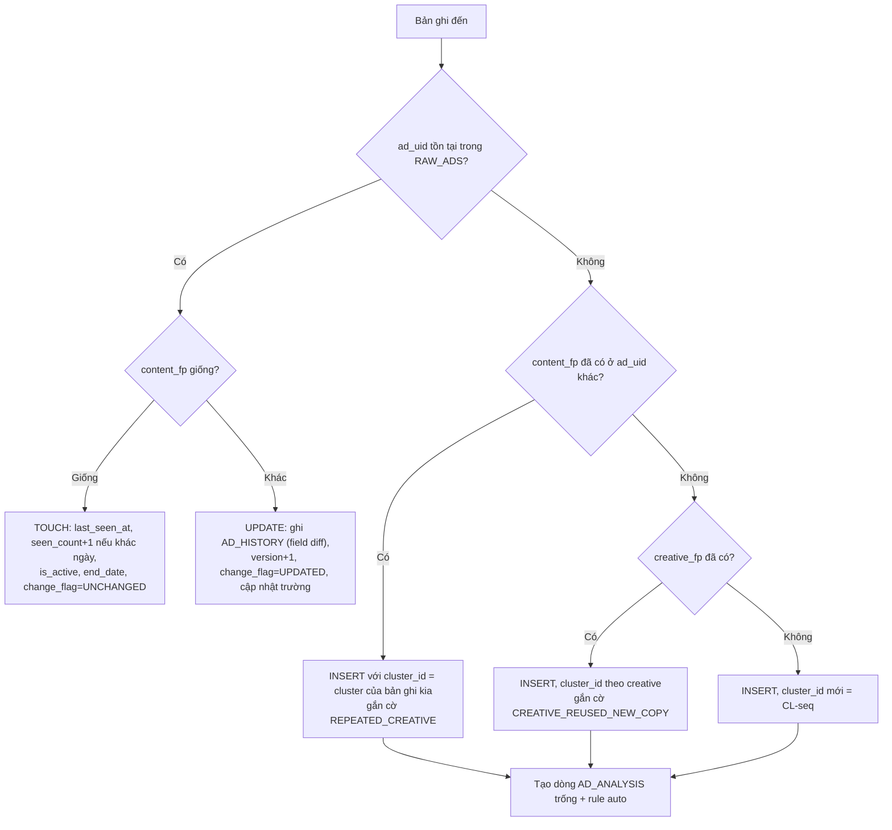

# 05 — Chống trùng lặp, cập nhật và logic phân tích

## 7.1 Ba lớp định danh

| Khóa | Công thức | Dùng để |
|---|---|---|
| `ad_uid` | `{src}:{native_id}`. `src ∈ {meta, li, gatc, lp, man}`. Không có native_id → `fp:{content_fp[0:16]}` | **Khóa chính** upsert. Cùng quảng cáo = cùng dòng |
| `content_fp` | `SHA256( platform_family | advertiser_key | body_norm | headline_norm | description_norm | cta_normalized | landing_key | creative_key )` | Phát hiện **nội dung đổi** (cùng `ad_uid`, khác fp) và **creative lặp lại** (khác `ad_uid`, cùng fp) |
| `creative_fp` | `SHA256( creative_key )` | Nhận diện cùng ảnh/video dùng lại với copy khác |

Chi tiết từng thành phần:

```
platform_family = META | LINKEDIN | GOOGLE         (không dùng placements chi tiết vì hay thay đổi)
advertiser_key  = advertiser_id nếu có, ngược lại slug(advertiser_name) bỏ dấu
body_norm       = normalizeForHash(body_text)        # file 04 §6.6
headline_norm   = normalizeForHash(headline)
landing_key     = registrable_domain + normalized_path   # bỏ query, bỏ UTM → đổi UTM không tính là đổi nội dung
creative_key    = ưu tiên theo thứ tự:
                  1. ID tài sản ổn định trong URL media (ví dụ tên file trên fbcdn trước dấu '?',
                     video id YouTube, id ảnh googleusercontent)
                  2. Nếu không có: dHash 64-bit của thumbnail (tính trong content script bằng canvas,
                     chỉ khi ảnh cho phép CORS; nếu canvas bị taint thì bỏ qua)
                  3. Nếu không có: chuỗi rỗng
```

Lý do tách `landing_key` khỏi UTM: đối thủ thay `utm_content` theo từng biến thể. Nếu tính UTM vào fp thì mọi biến thể đều thành "đổi nội dung". UTM vẫn được lưu riêng để phân tích.

## 7.2 Quy trình dedup hai tầng

**Tầng 1 — Extension (trước khi gửi):** `index-cache` (đồng bộ từ `GET action=index` mỗi 6 giờ + sau mỗi lần sync) giữ map `ad_uid → {content_fp, last_seen_at}`.
- Trong cùng một batch: gộp các capture cùng `ad_uid` (lấy bản có confidence cao nhất).
- So với index: gán nhãn overlay 🟢 Mới / 🔵 Đã có / 🟠 Đã đổi. Bản ghi "Đã có" vẫn gửi dạng **TOUCH** gọn (chỉ `ad_uid`, `seen_at`, `is_active`, `end_date`) để cập nhật `last_seen_at`, không gửi lại toàn bộ.

**Tầng 2 — Apps Script (nguồn sự thật), trong `LockService`:**



**Idempotency:** mỗi request có `request_id` (uuid). Apps Script lưu `request_id` vào `CacheService` 6 giờ. Nếu gửi lại cùng `request_id` thì trả lại kết quả cũ, không ghi lần 2 (tránh nhân đôi khi Extension retry sau timeout).

**Trường không bị ghi đè khi UPDATE/TOUCH:** `record_id`, `first_seen_at`, `tags`, `rating`, `notes`, `campaign_label`, mọi cột `*_manual`. Tag mới được **hợp nhất** (union), không thay thế.

**Near-duplicate (Phase 2):** hai bản ghi khác `content_fp` nhưng Jaccard trigram(body_norm) ≥ 0.85 và cùng advertiser → cùng `cluster_id`. MVP có thể làm bằng Apps Script (so trong cùng advertiser, O(n²) nhỏ).

## 7.3 Quảng cáo mới / đã cập nhật

| Nhãn | Điều kiện |
|---|---|
| **NEW (tuần này)** | `first_seen_at ≥ today − new_ad_window_days` **và** (`start_date` trống **hoặc** `start_date ≥ today − 14`). Nếu `start_date` cũ hơn nhiều so với `first_seen_at` thì là **"mới với hệ thống, không mới trên thị trường"** → nhãn `NEW_TO_US` |
| **UPDATED** | Có dòng AD_HISTORY trong 7 ngày |
| **REACTIVATED** | Trạng thái chuyển INACTIVE → ACTIVE |
| **STOPPED** | ACTIVE → INACTIVE, hoặc Google `last_shown` > 7 ngày |

## 7.4 Long-running và "tín hiệu ưu tiên"

```
run_days = (end_date if INACTIVE else today) − start_date      # nếu có start_date do nền tảng công bố
         = last_seen_at − first_seen_at                        # nếu không có (Google, thiếu dữ liệu)

is_long_running =
   run_days ≥ CONFIG.long_running_days_{platform}              # mặc định 30
   AND (start_date có sẵn OR seen_count ≥ long_running_min_sightings)
```

`priority_signal` (0–100) là tín hiệu **đối thủ có vẻ đang ưu tiên**, **không** phải hiệu quả:

| Thành phần | Điểm |
|---|---|
| Long-running (≥30 ngày) | 30 (+10 nếu ≥ 60 ngày) |
| `variant_count` ≥ 3 hoặc cluster có ≥ 3 `ad_uid` | 20 |
| Cùng cluster xuất hiện ≥ 2 nền tảng (Meta + Google/LinkedIn) | 15 |
| Đang ACTIVE | 10 |
| Được làm mới gần đây (UPDATED/biến thể mới trong 14 ngày) | 10 |
| Landing page có dấu hiệu đầu tư (form + offer + pricing) | 5 |

Hiển thị trên Dashboard kèm chú thích: *"Tín hiệu dựa trên thời gian chạy và số biến thể công khai. Không phản ánh ngân sách hay hiệu quả."*

## 7.5 Phân loại TOFU / MOFU / BOFU (rule-based có trọng số)

Tính điểm cho từng tầng trên văn bản gộp `body + headline + description + cta + landing_path`. Tầng có điểm cao nhất thắng. Hòa điểm hoặc tất cả = 0 → `UNCLASSIFIED`.

| Tầng | Tín hiệu (VI/EN) | Điểm |
|---|---|---|
| **TOFU** | xu hướng, bí quyết, mẹo, hướng dẫn, "bạn có biết", báo cáo thị trường, infographic, blog, podcast, tips, guide, trend, "what is" | +1 mỗi từ |
| | CTA `LEARN_MORE`, video ngắn không offer | +2 |
| | landing path `/blog`, `/tin-tuc`, `/cam-nang` | +2 |
| **MOFU** | ebook, whitepaper, checklist, template, mẫu JD, webinar, workshop, case study, so sánh, "vs", demo video, tính năng, calculator | +1 |
| | CTA `DOWNLOAD`, `REGISTER_EVENT` | +2 |
| | landing có form ≤ 4 trường, path `/webinar`, `/ebook`, `/case-study`, `/tinh-nang` | +2 |
| **BOFU** | dùng thử, miễn phí 7/14/30 ngày, giảm %, ưu đãi, báo giá, bảng giá, đặt lịch demo, tư vấn 1:1, "chỉ còn", hết hạn, ngay hôm nay, free trial, pricing, discount | +1 |
| | CTA `BOOK_DEMO`, `FREE_TRIAL`, `GET_QUOTE`, `CONTACT`, `SIGN_UP` | +3 |
| | landing `/pricing`, `/bang-gia`, `/dang-ky`, `/demo`, form có "quy mô công ty/số nhân sự" | +2 |

## 7.6 Nhận diện framework copywriting

Cắt `body_text` thành câu (theo `.!?…\n`). Đánh dấu vị trí xuất hiện tín hiệu (đầu = 1/3 đầu, giữa, cuối).

| Framework | Điều kiện (MVP rule) | Ví dụ tín hiệu |
|---|---|---|
| **PAS** | Problem ở 1/3 đầu **và** Agitate (hậu quả/tiêu cực/số liệu thiệt hại) **và** Solution (brand/"giúp"/"với X") ở sau | P: "bạn đang…?", "mệt mỏi", "mất hàng giờ", "tốn", "khó", "đau đầu", "struggling". A: "mất thêm", "chi phí gấp", "rủi ro", "tuyển sai". S: "giúp bạn", "chỉ với", "giải pháp" |
| **BAB** | Có cặp trạng thái trước/sau | "trước đây/trước khi… giờ đây/sau khi", "từ… đến…", "không còn…", "imagine", "hãy tưởng tượng" |
| **AIDA** | Hook gây chú ý (câu hỏi/số/emoji đầu) → tính năng (Interest) → lợi ích/kết quả (Desire) → CTA hành động rõ ở cuối | Có đủ ≥3/4 bước theo thứ tự |
| **SOCIAL_PROOF** | Có số lượng khách hàng, testimonial, logo, rating, giải thưởng, "được tin dùng bởi" | `\d+[.,]?\d*\+?\s*(doanh nghiệp|khách hàng|HR)`, "top 1", "★", "trusted by" |
| **FAB** | Liệt kê tính năng → ưu điểm → lợi ích (bullet ✓/•) | |
| **NONE** | Quá ngắn (< 12 từ) hoặc không khớp | |

Một quảng cáo có thể có **framework chính + social proof** (Social Proof thường là lớp phụ). Lưu `framework` = chính, tag `+social_proof`.

## 7.7 Creative angle — taxonomy cho HR Tech (chỉnh trong LISTS)

| Mã angle | Mô tả | Từ khóa rule |
|---|---|---|
| `SPEED` | Tuyển nhanh, time-to-hire | nhanh, 24h, 7 ngày, ngay, tức thì, fast |
| `COST_ROI` | Tiết kiệm chi phí, ROI | chi phí, tiết kiệm, rẻ, ROI, ngân sách, giảm % |
| `QUALITY_FIT` | Đúng người, phù hợp văn hóa, năng lực | đúng người, phù hợp, chất lượng, năng lực, culture fit |
| `AI_TECH` | AI, tự động hóa | AI, trí tuệ nhân tạo, tự động, thông minh, matching |
| `VOLUME_REACH` | Kho ứng viên lớn, tiếp cận | triệu ứng viên, hàng ngàn CV, tiếp cận, reach |
| `EASE` | Dễ dùng, 1 nền tảng | dễ dàng, đơn giản, 1 click, all-in-one |
| `PAIN_FEAR` | Nỗi đau/rủi ro tuyển sai | tuyển sai, nghỉ việc, mất ứng viên, CV rác |
| `SOCIAL_PROOF` | Uy tín, khách hàng lớn | tin dùng, khách hàng, top, giải thưởng |
| `OFFER_PROMO` | Khuyến mãi, miễn phí | miễn phí, giảm, ưu đãi, tặng, voucher |
| `EDUCATION` | Kiến thức, báo cáo, cẩm nang | báo cáo, cẩm nang, xu hướng, webinar |
| `EVENT` | Sự kiện, hội thảo | sự kiện, hội thảo, workshop, meetup |
| `EMPLOYER_BRAND` | Thương hiệu nhà tuyển dụng | employer branding, thương hiệu tuyển dụng, EVP |
| `DATA_REPORTING` | Dashboard, đo lường | báo cáo, dashboard, số liệu, đo lường |
| `SEASONAL` | Mùa vụ | Tết, sau Tết, cuối năm, back to work, mùa tuyển dụng |
| `COMPARISON` | So sánh đối thủ | so sánh, thay vì, khác biệt, vs |

MVP: gán theo số từ khóa khớp (angle chính = điểm cao nhất, angle phụ = điểm ≥ 50% angle chính). Phase 2: embedding body_text → clustering (HDBSCAN/k-means) → Claude đặt tên cluster và map về taxonomy. Cluster không khớp taxonomy được đề xuất thành **angle mới** để marketer duyệt.

## 7.8 So sánh thông điệp giữa đối thủ

- **Ma trận Competitor × Angle** (tỷ lệ % quảng cáo của từng đối thủ theo angle, trong 90 ngày, lọc `audience_side = EMPLOYER`). Heatmap bằng conditional formatting.
- **Ma trận Competitor × Pain point** và **Competitor × Offer type**.
- **Share of Ads** (không phải share of voice/spend) = số quảng cáo ACTIVE của đối thủ / tổng số ACTIVE.
- **Độ trùng thông điệp** giữa hai đối thủ = Jaccard tập angle (đơn giản) hoặc cosine TB embedding (Phase 2).
- **Khoảng trống thông điệp** (message gap): angle/pain có (a) trend search tăng hoặc pain phổ biến trong nghiên cứu khách hàng, (b) ≤ 1 đối thủ sử dụng, (c) brand fit ≥ 4 với Link Talent. Ví dụ giả thuyết: "đánh giá năng lực 3C" hoặc "báo cáo ROI tuyển dụng cho CEO" nếu chưa đối thủ nào nói.

## 7.9 Phát hiện thay đổi landing page, offer, CTA

- **Landing page:** so `section_hashes_json` của snapshot mới với snapshot gần nhất cùng `url_key`. Section có hash khác → `changed_sections`. `change_summary` = diff text ngắn (MVP: "cũ → mới" của `offer`, `primary_cta`, `h1`, `price_points`). URL chết (404) hoặc redirect sang URL khác → cảnh báo.
- **Offer/CTA trong quảng cáo:** từ AD_HISTORY, lọc `changed_fields` chứa `cta_text` hoặc (offer_type khác trước).
- **Ở cấp đối thủ:** offer_type phổ biến tuần này so với 4 tuần trước ("CareerViet chuyển từ LEARN_MORE sang FREE_TRIAL ở 60% quảng cáo mới").

## 7.10 Chấm điểm cơ hội 1–10 (tab OPPORTUNITIES)

Đơn vị chấm: **một angle** (hoặc angle × pain point). Mỗi thành phần chuẩn hóa về 0–1:

| Thành phần | Công thức | Diễn giải |
|---|---|---|
| **Popularity P** | `0.5 × (competitors_using / total_competitors) + 0.5 × MIN(1, long_running_count / 3)` | Angle được nhiều đối thủ dùng và giữ lâu → thị trường có phản hồi (bằng chứng gián tiếp) |
| **Differentiation D** | `1 − saturation`, `saturation = share_of_ads_angle / MAX(share_of_ads các angle)`. Cộng 0.2 (cap 1) nếu Link Talent có USP riêng cho angle này (3C, đa kênh Zalo/SMS, Dashboard ROI) | Càng ít người nói, càng dễ khác biệt |
| **Trend T** | Trung bình `momentum` của các keyword có `mapped_angles` chứa angle, map `[-50%, +50%] → [0, 1]` (cắt biên) | Nhu cầu tìm kiếm đang lên |
| **Brand fit B** | `(brand_fit_1_5 − 1) / 4`, do marketer chấm | Phù hợp định vị Link Talent |

```
score_raw = wP·P + wD·D + wT·T + wB·B          # trọng số CONFIG.score_weights, mặc định 0.25/0.25/0.20/0.30
opportunity_score = ROUND(1 + 9 × score_raw, 1)  # thang 1–10
```

P và D cố ý ngược chiều nhau: điểm cao nhất rơi vào angle **đã được thị trường chứng minh một phần nhưng chưa bão hòa**, có trend và hợp thương hiệu. Mỗi điểm luôn hiển thị kèm 4 thành phần và `evidence_record_ids` để người đọc tự kiểm chứng.

## 7.11 Nguyên tắc "không sao chép"

- Mọi ý tưởng đề xuất phải xuất phát từ **insight** (pain, desire, gap), không từ câu chữ của đối thủ.
- Kiểm tra tương đồng: headline/body đề xuất so với toàn bộ RAW_ADS. Jaccard trigram ≥ 0.5 hoặc (Phase 2) cosine embedding ≥ 0.85 → `copy_risk = HIGH`, bắt buộc viết lại.
- Không dùng tên thương hiệu, slogan, hình ảnh, nhân vật, số liệu của đối thủ. Claim số liệu của Link Talent phải có nguồn nội bộ.
